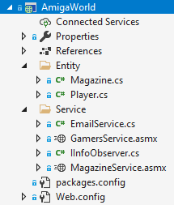
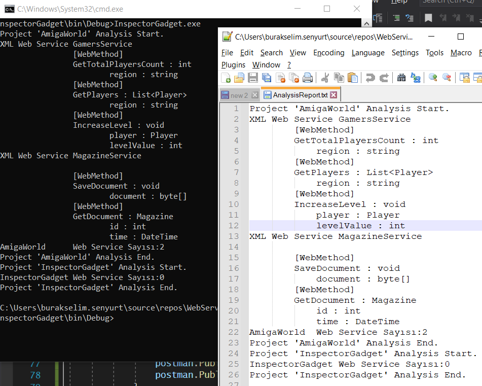

# WebService Detective

Eski bir uygulamadaki web servis ve web servis metotlarını, statik kod analizi yardımıyla tarayıp bulmak istersek ne yapabiliriz sorusuna Roslyn'den de destek alıp bakmaya çalışıyoruz.

__Motivasyon__ : Legacy bir .net uygulaması içinde kullanılan web servis ve web servis metotlarının statik kod analizi ile çıkarılması. Roslyn kullanarak bu çözümün uygulanması bekleniyor.

## Başlangıç

Senaryo gereği içinde çeşitli tipte sınıflar ve web servisler barındıran bir proje var. AmigaWorld bu amaçla tasarlanmış dummy türde .Net Framework tabanlı bir çözüm. İşe yarar hiçbir şey yapmıyor ama Roslyn tarafını kandırmak için değişik tuzaklar içermekte. Örneğin Service klasörü içinde WebService olmayan tipler var _(ya da Entity klasöründe)_ Bu tiplere bakmayıp WebService niteliğini _(attribute)_ uygulayan ve içinde WebMethod niteliği kullanan operasyonları ele almamız gerekiyor.

Amaç GamersService.asmx ve MagazineService.asmx ile içindeki web metotları yakalamak.

## Gelişim

- Çözüme Roslyn kullanan bir Console uygulaması ekledim.
- Hem Console'a hem de Text dosyasına log bırakmak istediğimden Observer desenini kullanan bir düzenleme yaptım.
- İlkel kodlarla solution içindeki projeleri ve ilgili nitelikleri uygulayan tipleri dolaşıp bilgilerini ekrana bastırdım.

Buna göre aşağıdakine benzer bir çıktı elde ettim.

